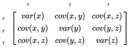

# Principal Component Analysis (PCA)

PCA is a tool for dimensionality reduction

- Finds the principle components of the data: an ordered series of vectors along which the most variance lies
- The first principle (which explains the most variance) is the longest one, the second principle is the second longest, etc.
- We can decide to keep however many components we want

## How PCA works

1. Center points on the origin
2. Create [covariance](Covariance.md) matrix for the data
    
    
    
3. The principle components of our data are the **eigenvectors** of this matrix

## Pros of PCA

- Dimension reduction: PCA reduces number of features while retaining essential info, making datasets more manageable
- Noise reduction: Eliminates noise in data, improving feature quality and model performance
- Feature transformation: Transforms original features into orthogonal components, potentially revealing hidden patterns
- Visualization: PCA can simplify data into 2D or 3D for easier visual understanding
- Feature selection: PCA ranks principal components, helping indirectly in feature selection

## Cons of PCA

- Linearity: PCA assumes straight-line relationships in data, which isn’t always the case
- Interpretability: Principal components can be hard to understand in terms of original features
- Loss of information: PCA prioritizes variance and might lose important data details
- No feature learning: PCA doesn't create new features; it only works with what’s already there