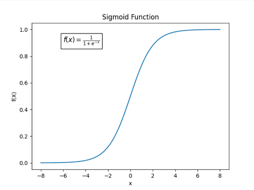

## Sigmoid

Compute activation as $\sigma(\sum_i^N w_i a_i)$, where $\sigma$ is any function bounded between 0 and 1, usually the **sigmoid function**.
For all of the inner nodes, this bounds activation between 0 and 1.

## ReLU

Rectified linear unit is an alternative to sigmoid function that's more popular for [Convolutional Neural Networks](Neural%20Networks/Convolutional%20Neural%20Networks.md Neural Networks.md>):

- Faster to compute than sigmoid
- Useful if you only want positive values

Function:

- If input is negative or 0, output is 0
- If input is positive, output is equal to input

