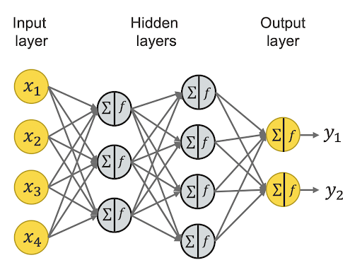

---
tags:
  - neural-networks
---
## History of Neural Networks
### Perceptrons

Weakness of linear perceptron: Could only classify linearly separable data

### Multi-Layer Neural Networks

Multi-layer neural networks were invented next:

- Each computational unit (neuron) is a node in a directed acyclic graph
- Neurons have **activation values** representing how activated one particular neuron is
- Neurons can pass their activation values on to their neighbors, based on the weight of the connection between them
- Usually has an **input layer** and an **output layer**

#### Activation Rule

A node's activation is $\sum_i^N w_i a_i$, where $N$ is the set of nodes in the previous layer

#### Non-Linear Activation Function

The problem with the above approach is that if inputs are too big, nodes can have enormous activation values

So we use non-linear [activation functions](Activation%20functions.md) that bound values between 0 and 1

This also lets the network do more complicated things than linear activation function - other nodes can now dampen one node's signal

### Multi-Layer Feed-Forward Neural Networks

To classify something (binary classification):

- Activate the input layer with the values of the input vector we want to classify
- Propagate activation to each hidden layer
- Whichever one of the outputs is more activated, that's the classification

Originally used for handwriting recognition, pretty good at it

## Backpropagation

## Convolutional Neural Networks (CNNs)

[CNNs](CNNs.md) are used for image classification
