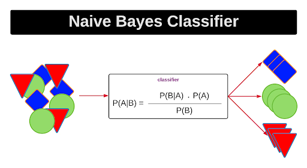

---
tags:
  - instance-based
  - classification
---
Use Bayes Rule to predict $P(\text{Class} \mid \text{Features})$

**Instance based model**, so needs all data with it

Works best if all your variables are conditionally independent

Assumes that all features are equally important in deciding outcome

