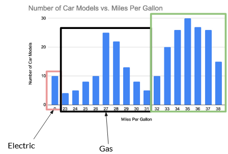
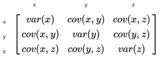

Covered in lecture 10/17 (?)

[Slides](https://docs.google.com/presentation/d/1zE54CPwDybdcAziepPob7hqC_aEEogAfsD7wZKLn-m0/edit#slide=id.g2848ac0f2f8_0_203)

**Table of Contents**

Feature engineering is the creation or modification of columns to make life easier for us or our machine learning models

Generally, mathematical models:

- Don’t like categorical data
- Don’t do super well with columns that have different scales
- Are fussy in lots of other ways

## Transforms

Creating a new column by applying a function over a column

Transforms can be **linear** or **non-linear**

### Normalization

$$
x_{scaled} = \frac{x - x_{min}}{x_{max} - x_{min}}
$$

### Standardization

We apply this formula and set the mean to 0 and standard deviation to 1:

$$
z = \frac{x_i - \mu}{\sigma}
$$

### Log Transforms

If you have a power law distribution that you want to make more normal, simply take the log of the distribution

## One Hot Encoding

Some ML models hate categorical data, which is where one hot encoding comes in

Make a separate column for each category, and put a 1 or 0 in each category’s column depending on whether that row is in that category

Pros:

- You get to use your categorical variables

Cons:

- If there are 50 categories, your dataset explodes

```python
pd.get_dummies(series)
```

## Binning

Binning is taking a continuous feature and introducing a column that categorizes it



### When to Bin Manually

Bin manually when there is a **boundary condition** that is not obvious in the data. Examples:

- GPA: passing vs. failing
- Location: County
- MPG: Car type (electric vs. gas)

## Clustering

### K-Means Clustering

K-means clustering is an unsupervised learning algorithm to assign each data point to a cluster

- $k$ is how many clusters you expect
- Tries to minimize the weighted distance between all points and the center of their assigned clusters
- The algorithm starts with randomly assigned centroids, then converges
    - At each step, each point is assigned to the closest centroid
    - The centers of each of these clusters become the new centroids
    - Repeat until it converges

[Visualization](https://www.naftaliharris.com/blog/visualizing-k-means-clustering/) of k-means clustering

### Hierarchical Clustering

Pros:

- More likely to converge correctly
- Gives you a dendrogram, which gives you a more complete picture of the dataset

Limits:

- High time and space complexity
    - Cannot be used for large datasets
- No objective function for hierarchical clustering
- Sensitive to noise and outliers since we use distance metrics
- Difficulty handling large clusters

## Dimensionality Reduction

Sometimes we have too many dimensions and need to get rid of some

If you have obviously irrelevant variables, you can just remove those, but not always that easy

### Principal Component Analysis (PCA)

PCA is a tool for dimensionality reduction

- Finds the principle components of the data: an ordered series of vectors along which the most variance lies
- The first principle (which explains the most variance) is the longest one, the second principle is the second longest, etc.
- We can decide to keep however many components we want

**How PCA works**

1. Center points on the origin
2. Create [[Covariance|covariance]] matrix for the data
    
    
    
3. The principle components of our data are the **eigenvectors** of this matrix

**Pros of PCA:**

- Dimension reduction: PCA reduces number of features while retaining essential info, making datasets more manageable
- Noise reduction: Eliminates noise in data, improving feature quality and model performance
- Feature transformation: Transforms original features into orthogonal components, potentially revealing hidden patterns
- Visualization: PCA can simplify data into 2D or 3D for easier visual understanding
- Feature selection: PCA ranks principal components, helping indirectly in feature selection

**Cons of PCA:**

- Linearity: PCA assumes straight-line relationships in data, which isn’t always the case
- Interpretability: Principal components can be hard to understand in terms of original features
- Loss of information: PCA prioritizes variance and might lose important data details
- No feature learning: PCA doesn’t create new features; it only works with what’s already there