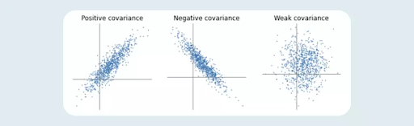

- Variance: For a single column of data, variance is the average of how far something is from the mean
- Covariance: For two columns of data, covariance measures how correlated being far away from the mean is

