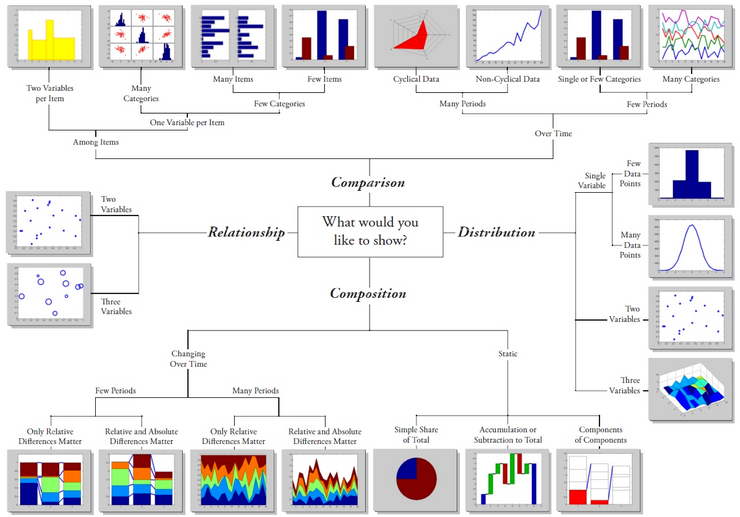

## Types of Visualization

Common visualization types to choose from

Main types of visualizations:

- Comparison - Bar chart, table chart, word cloud
- Correlation - Heatmap, scatter plot, bubble chart
- Part-to-Whole and Hierarchical - Pie chart, stacked bar/column chart, Venn diagram
- Data Over Time - Line chart, candlestick chart
- Distribution - Histogram, box chart