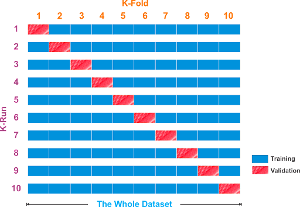

> [!warning]
> Don’t use this if you only have a little data

- Cut the data into $k$ chunks
- Make $k$ splits. In each, use one chunk for testing and the other $k-1$ chunks for training
- Train on those, report test accuracy

